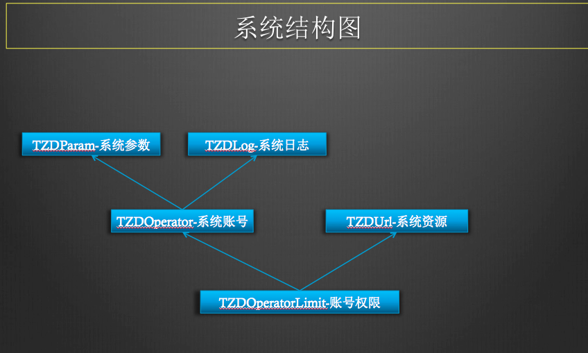
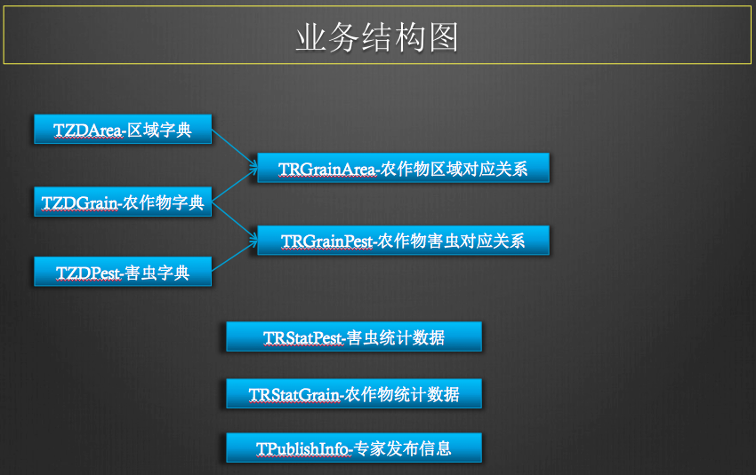

## API接口.
1. 调用方式: HTTP.
1. 序列化方式: JSON.
1. 字符编码: UTF-8.
1. 授权方式: account + password.

## 错误代码
1. 10001:参数不合法.
1. 10002:系统未知错误.
1. 20001:授权错误.
1. 20003:签名错误.
1. 30001:数据错误,重复数据.
1. 30002:数据错误,不存在数据.

## 业务流程.
1. 区域字典数据初始化.
1. 作物字典数据初始化.
1. 害虫字典数据初始化.
1. 害虫采集数据上传.
1. 专家发布信息.
1. 害虫数据统计查询分析.

## 对象过滤查询模型.
1. 查询对象类接口统一采用MapFilter进行过滤.
1. MapFilter以过滤算子形式依次进行数据过滤.
1. 请求参数以对象字段+过滤算子后缀进行识别.
1. 当对象字段不加后缀默认以Equal算子进行过滤.
1. 对象字段在请求参数中有其他作用时,用加Equal后缀方式进行标识.
1. 关键字字段不提供过滤算子支持.
```
//过滤算子字段后缀
public static final String suffixEqual = "Equal";           //==
public static final String suffixIn = "In";                 //in
public static final String suffixLike = "Like";             //like
public static final String suffixGreat = "Great";           //>
public static final String suffixGreatEqual = "GreatEqual"; //>=
public static final String suffixLess = "Less";             //<
public static final String suffixLessEqual = "LessEqual";   //<=
```


## API服务
1. [系统管理API](api_system.md)
1. [区域API](api_area.md)
1. [气候API](api_feature.md)
1. [农作物API](api_grain.md)
1. [害虫API](api_pest.md)
1. [农作物与区域对应关系API](api_grain_area.md)
1. [农作物与害虫对应关系API](api_grain_pest.md)
1. [专家信息发布API](api_publish.md)
1. [农作物产量统计API](api_stat_grain.md)
1. [害虫数量统计API](api_stat_pest.md)
1. [文件上传API](api_upload.md)


